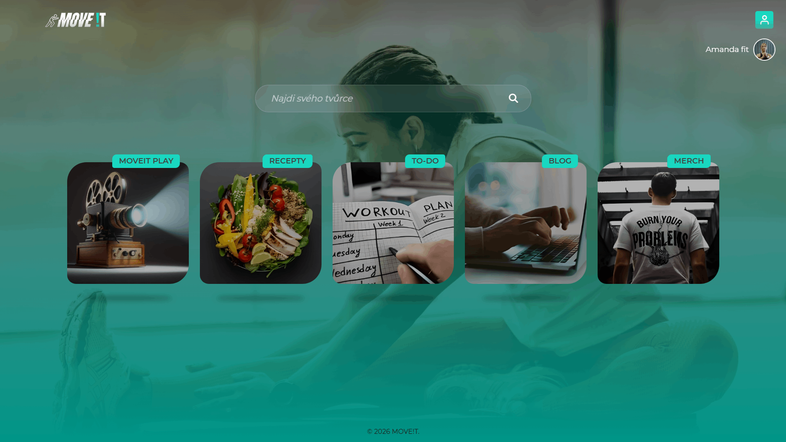
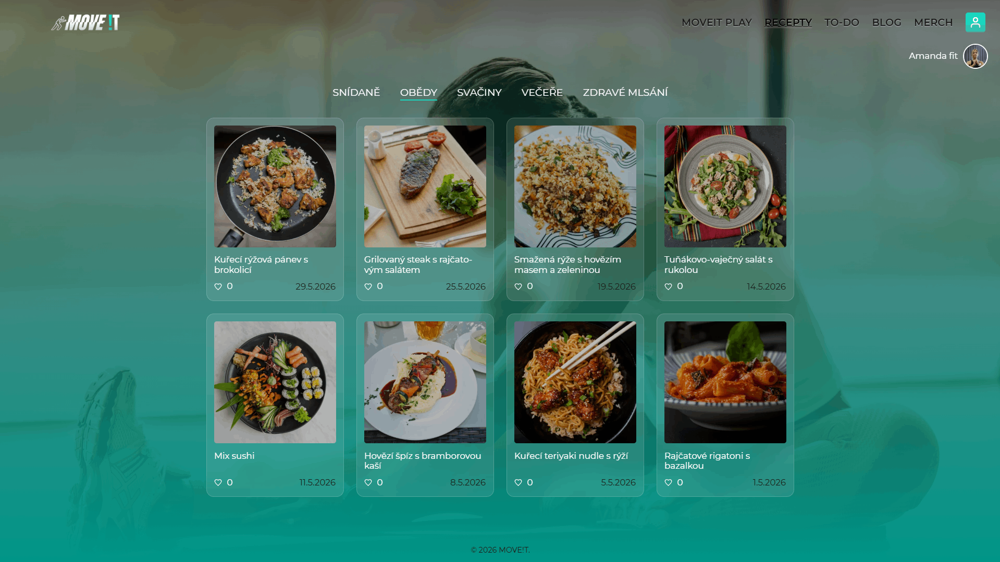
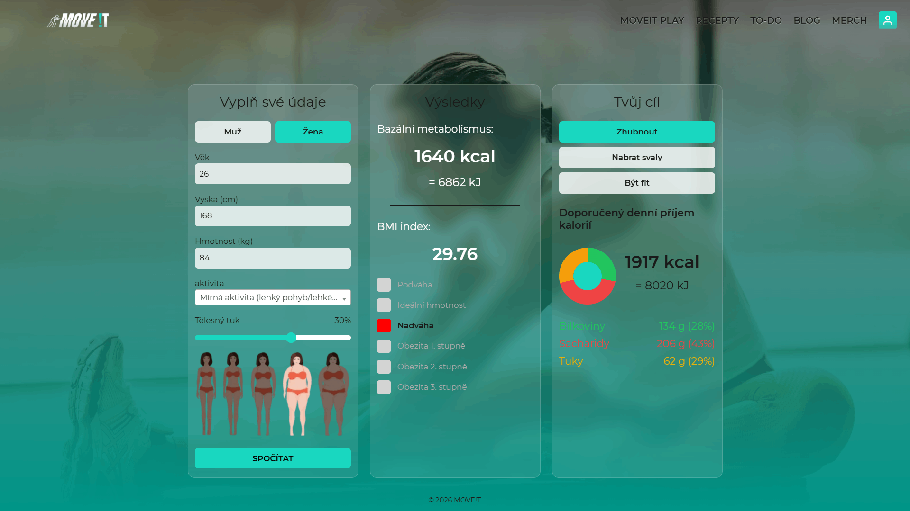
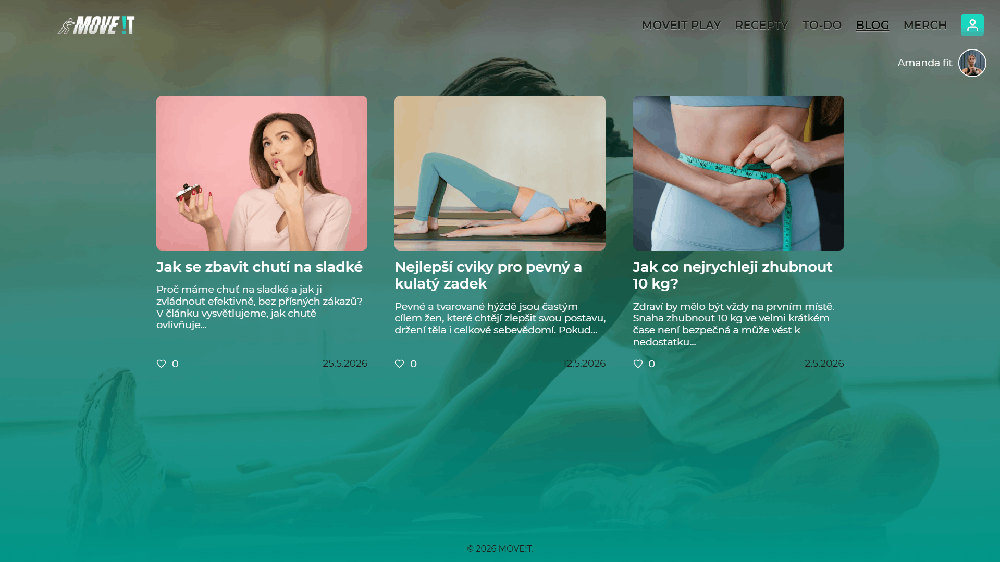
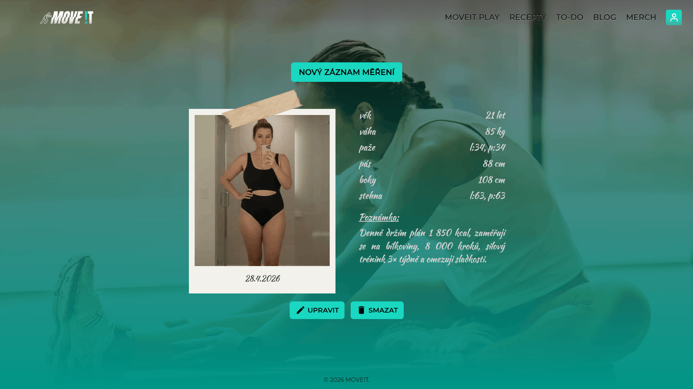

# MOVE!T – SaaS Platform Technical Showcase

MOVE!T is a production SaaS platform for fitness creators that I independently designed, developed, deployed and continue to maintain.

This repository presents selected screenshots and production code samples from the application. The complete production source code is private for security and commercial reasons.

## Live application

[Visit getmoveit.com](https://getmoveit.com)

## About the project

MOVE!T provides fitness creators with tools for publishing content, managing their profiles and offering paid subscriptions to their audience.

The application includes:

- user registration and account management,
- creator profiles and role-based permissions,
- publishing and management of fitness content,
- paid subscriptions and creator monetization,
- invoicing and administration,
- integrations with external services and APIs,
- server-side validation and form security,
- responsive user interface for desktop and mobile devices.

## My responsibilities

I am responsible for the complete development and operation of the platform, including:

- application architecture,
- database design,
- backend development,
- frontend implementation,
- external API integrations,
- deployment and production configuration,
- debugging and maintenance,
- continued product development.

## Technologies

### Backend

- PHP 8.x
- Nette Framework
- REST API

### Database

- MySQL
- database design
- SQL query development and optimization

### Frontend

- HTML
- CSS
- Tailwind CSS
- SCSS
- JavaScript

### Development tools

- Git and GitFlow
- PHPStan
- PHPCS
- PhpStorm
- Jira
- Claude Code / AI-assisted development

## Repository contents

## Application screenshots

The screenshots below show selected parts of the MOVE!T platform using demonstration data.

### Main dashboard

The main dashboard provides access to the key sections of the platform.

  

<table>
  <tr>
    <td width="50%" valign="top">
      <strong>MOVE!T Play</strong>  
      Content platform for training, nutrition and educational materials.
        
      
    </td>
    <td width="50%" valign="top">
      <strong>Recipes</strong>  
      Recipe catalogue with categories, images and user interactions.
        
      
    </td>
  </tr>
  <tr>
    <td width="50%" valign="top">
      <strong>Fitness calculator</strong>  
      Interactive calculation of BMI, basal metabolism and recommended calorie intake.
        
      
    </td>
    <td width="50%" valign="top">
      <strong>Blog</strong>  
      Publishing and presentation of fitness-related articles.
        
      
    </td>
  </tr>
</table>

### Progress diary

Users can record measurements, notes and progress photographs.

  

### Code samples

The [`code-samples/recipes`](./code-samples/recipes) directory contains selected production code from the Recipes module.

The sample demonstrates the application flow across the Nette form, presenter, service and repository layers.

## Source code notice

This repository is not a complete or runnable copy of MOVE!T.

The full source code remains private because the application is an actively developed production SaaS product. API credentials, configuration files, personal information, security-sensitive implementation details and third-party code are not included.

## Author

**Jan Mastík**  
PHP / Nette Full-stack Developer

- Website: [getmoveit.com](https://getmoveit.com)
- GitHub: [github.com/HonzaMastik](https://github.com/HonzaMastik)
